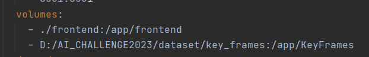

# Clip-Image-Retrieval

This code is based on this github: https://github.com/EduardoPach/Semantic-Image-Search

# Steps to run the code
1. Make sure you have docker installed
- Git clone the repository to the directory you want
-  In file docker-compose.yml, map it to your folder containing key_frames 
- in folder embeddings,please add your image encoding vectors
- in file api/main.py and file frontend/app.py ,Please pay attention to the links to see if they are correct
- When everything is okay, go to the next step.
2. Run command: docker compose up

